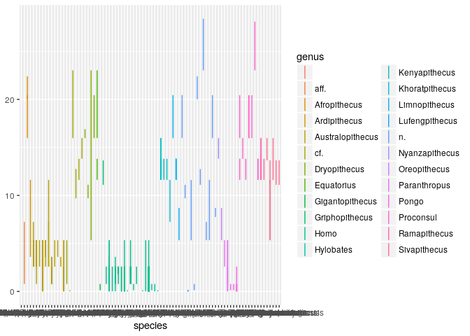
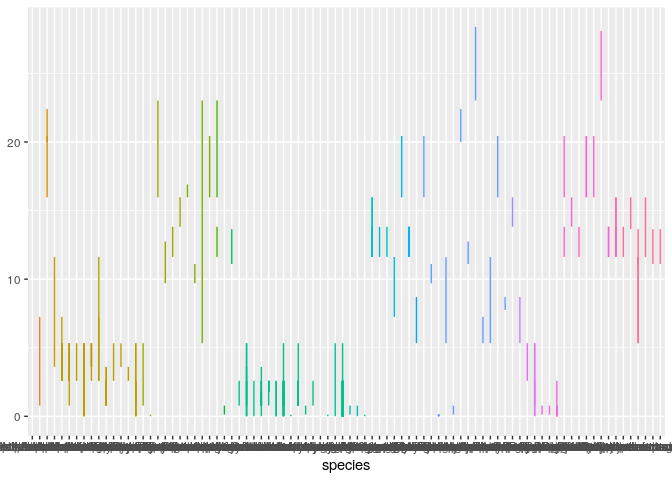
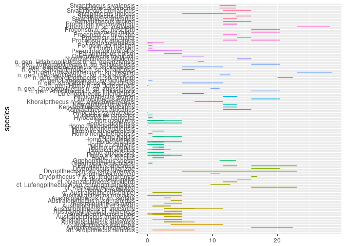
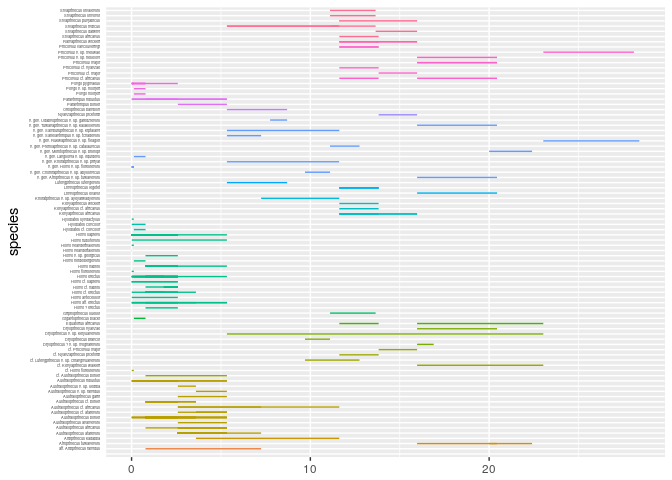
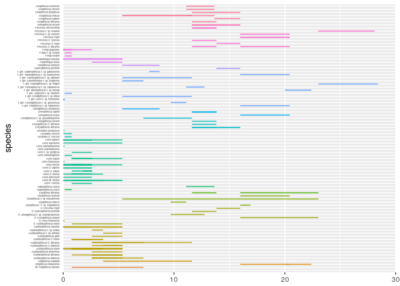
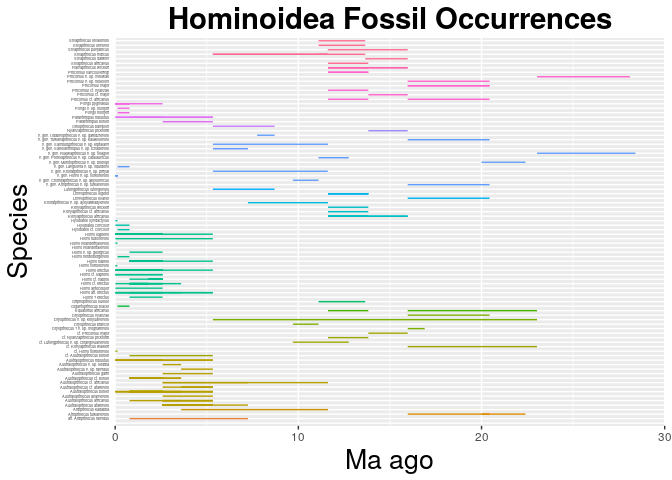

    library(ggplot2)
    homins <- read.csv("~/Desktop/eeb-177/eeb-174-final-project/apeoutput.csv", header = F, as.is = T)
    names(homins) <- c("genus", "species", "minage", "maxage")
    head(homins)

    ##            genus                    species  minage maxage
    ## 1 Lufengpithecus Lufengpithecus lufengensis  8.7000 5.3330
    ## 2   Sivapithecus       Sivapithecus indicus 11.6080 5.3330
    ## 3          Pongo             Pongo pygmaeus  0.7810 0.0117
    ## 4           Homo               Homo sapiens  0.0117 0.0000
    ## 5           Homo               Homo sapiens  0.1260 0.0117
    ## 6           Homo               Homo erectus  1.8060 0.7810

    ape_occ <- ggplot(homins, aes( species, ymin = maxage, ymax=minage, colour = genus))
    ape_occ <- ape_occ + geom_linerange()
    ape_occ

    ## Warning: Removed 1 rows containing missing values (geom_linerange).

    ape_occ <- ape_occ + theme(legend.position="none")
    ape_occ

    ## Warning: Removed 1 rows containing missing values (geom_linerange).

    ape_occ <- ape_occ + coord_flip()
    ape_occ

    ## Warning: Removed 1 rows containing missing values (geom_linerange).

    ape_occ <- ape_occ + theme(legend.position="none")
    ape_occ

    ## Warning: Removed 1 rows containing missing values (geom_linerange).

    ape_occ <- ape_occ +  theme(axis.text.y = element_text(size=3))
    ape_occ

    ## Warning: Removed 1 rows containing missing values (geom_linerange).

    ape_occ <- ape_occ + theme(axis.ticks.y=element_blank())
    ape_occ

    ## Warning: Removed 1 rows containing missing values (geom_linerange).

    ape_occ <- ape_occ + scale_y_continuous(limits=c(0, 30), expand = c(0, 0), breaks=c(0, 10, 20, 30, 40))
    ape_occ

    ## Warning: Removed 1 rows containing missing values (geom_linerange).

    ape_occ <- ape_occ + labs(title = "Hominoidea Fossil Occurrences", x = "Species", y = "Ma ago") + theme(plot.title = element_text(hjust = 0.5, size=22, face = "bold"), axis.title =element_text(size=20))
    ape_occ

    ## Warning: Removed 1 rows containing missing values (geom_linerange).

    ggsave(filename = "homin-occ.pdf", plot = ape_occ)

    ## Saving 7 x 5 in image

    ## Warning: Removed 1 rows containing missing values (geom_linerange).
