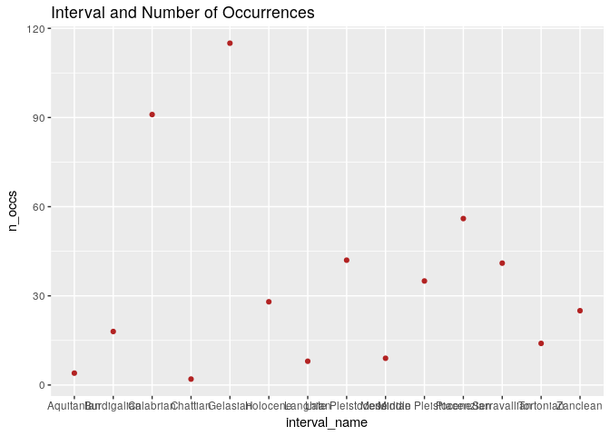

    library(ggplot2)
    haplogg<-read.csv("~/Desktop/eeb-177/eeb-174-final-project/haploformatted17.csv", as.is=T)

    head(haplogg)

    ##   occurrence_no record_type reid_no flags collection_no
    ## 1        138735         occ      NA    NA         11798
    ## 2        138736         occ      NA    NA         11798
    ## 3        138831         occ      NA    NA         11800
    ## 4        150075         occ   22506    NA         13293
    ## 5        150076         occ      NA    NA         13293
    ## 6        150077         occ      NA    NA         13293
    ##              identified_name identified_rank identified_no
    ## 1 Lufengpithecus lufengensis         species         89270
    ## 2     Laccopithecus robustus         species         58366
    ## 3       Sivapithecus indicus         species        133688
    ## 4         Hylobatidae indet.          family         40889
    ## 5             Pongo pygmaeus         species        183261
    ## 6                 Macaca sp.           genus         40869
    ##            difference          accepted_name accepted_rank accepted_no
    ## 1 species not entered         Lufengpithecus         genus       89270
    ## 2                     Laccopithecus robustus       species       58366
    ## 3                       Sivapithecus indicus       species      133676
    ## 4                                Hylobatidae        family       40889
    ## 5                             Pongo pygmaeus       species      232338
    ## 6                                     Macaca         genus       40869
    ##       early_interval    late_interval max_ma min_ma reference_no
    ## 1           Turolian                   8.700 5.3330         4196
    ## 2           Turolian                   8.700 5.3330        11394
    ## 3       Late Miocene                  11.608 5.3330         4199
    ## 4 Middle Pleistocene Late Pleistocene  0.781 0.0117        29343
    ## 5 Middle Pleistocene Late Pleistocene  0.781 0.0117         4412
    ## 6 Middle Pleistocene Late Pleistocene  0.781 0.0117         4412

    g<-ggplot(haplogg, aes(accepted_rank, max_ma))+geom_point(color="firebrick")
    g<-g+ggtitle('Rank and Max_ma')
    g

    plot1 <- ggplot(haplogg, aes(x=accepted_rank)) + geom_bar() + labs(title="Occurrence Count")  # Y axis derived from counts of X item
    print(plot1)

    haplodiv<-read.csv("~/Desktop/eeb-177/eeb-174-final-project/haplodiversity21.csv", as.is=T)

    head(haplodiv)

    ##   interval_no      interval_name max_ma min_ma X_Ft X_bL X_FL X_bt
    ## 1        3002           Holocene 0.0117 0.0000    0    1    0    0
    ## 2         922   Late Pleistocene 0.1260 0.0117    0    1    2    1
    ## 3         923 Middle Pleistocene 0.7810 0.1260    1    1    2    1
    ## 4         740          Calabrian 1.8060 0.7810    1    1    0    1
    ## 5         741           Gelasian 2.5880 1.8060    0    0    0    2
    ## 6          96         Piacenzian 3.6000 2.5880    1    1    0    1
    ##   sampled_in_bin n_occs
    ## 1              1     28
    ## 2              4     42
    ## 3              5     35
    ## 4              3     91
    ## 5              2    115
    ## 6              3     56

    g<-ggplot(haplodiv, aes(interval_name, n_occs))+geom_point(color="firebrick")
    g<-g+ggtitle('Interval and Number of Occurrences')
    g + theme(axis.text.x=element_text(angle=50, size=7, vjust=0.5))

    g

    haplomeas<-read.csv("~/Desktop/eeb-177/eeb-174-final-project/haplomeasurements17.csv", as.is=T)

    head(haplomeas)

    ##   measurement_no specimen_no record_type n_measured position measurement
    ## 1          48329       25970         mea          1                width
    ## 2          48330       25970         mea          1               length
    ## 3         113827       57217         mea         21                 mass
    ## 4         113828       57218         mea         10               length
    ## 5         113829       57219         mea         10               length
    ## 6         113830       57220         mea         10               length
    ##   average min max
    ## 1    21.5  NA  NA
    ## 2    65.8  NA  NA
    ## 3 42700.0  NA  NA
    ## 4   269.6  NA  NA
    ## 5   220.5  NA  NA
    ## 6   289.1  NA  NA

    g<-ggplot(haplomeas, aes(measurement, average))+geom_point(color="firebrick")
    g<-g+ggtitle('Measurement and Average')
    g + theme(axis.text.x=element_text(angle=50, size=7, vjust=0.5))

    g

    plot2 <- ggplot(haplomeas, aes(x=measurement)) + geom_bar() + labs(title="Measurement Count")  # Y axis derived from counts of X item
    print(plot2)

    library(ggplot2)
    haplo_rich<-read.csv("~/Desktop/eeb-177/eeb-174-final-project/haplominmax3.csv", as.is=T)

    head(haplo_rich)

    ##   xx             accepted_name min_ma max_ma
    ## 1 ##       Archicebus achilles   55.8   48.6
    ## 2 ##   Donrussellia lusitanica   55.8   48.6
    ## 3 ## Donrussellia provincialis   55.8   48.6
    ## 4 ##       Afrotarsius libycus   48.6   33.9
    ## 5 ##         Biretia piveteaui   48.6   33.9
    ## 6 ##      Eosimias centennicus   48.6   33.9

    plot10 <-ggplot(haplo_rich, aes(max_ma)) + geom_freqpoly(binwidth=3)
    print(plot10)

\`\`\`
