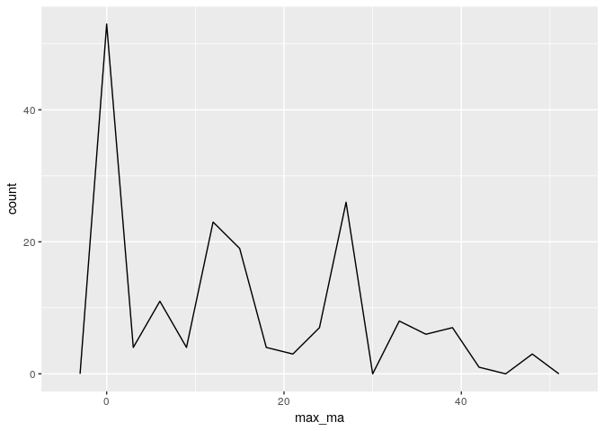

    library(ggplot2)
    haplo_rich<-read.csv("~/Desktop/eeb-177/eeb-174-final-project/haplominmax3.csv", as.is=T)

    head(haplo_rich)

    ##   xx             accepted_name min_ma max_ma
    ## 1 ##       Archicebus achilles   55.8   48.6
    ## 2 ##   Donrussellia lusitanica   55.8   48.6
    ## 3 ## Donrussellia provincialis   55.8   48.6
    ## 4 ##       Afrotarsius libycus   48.6   33.9
    ## 5 ##         Biretia piveteaui   48.6   33.9
    ## 6 ##      Eosimias centennicus   48.6   33.9

    plot1 <-ggplot(haplo_rich, aes(max_ma)) + geom_freqpoly(binwidth=3)
    print(plot1)

\`\`\`
